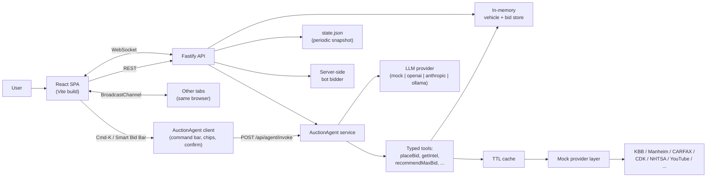
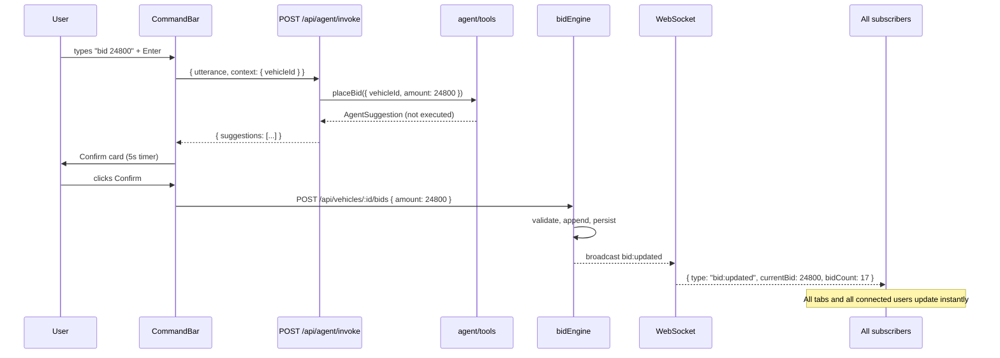
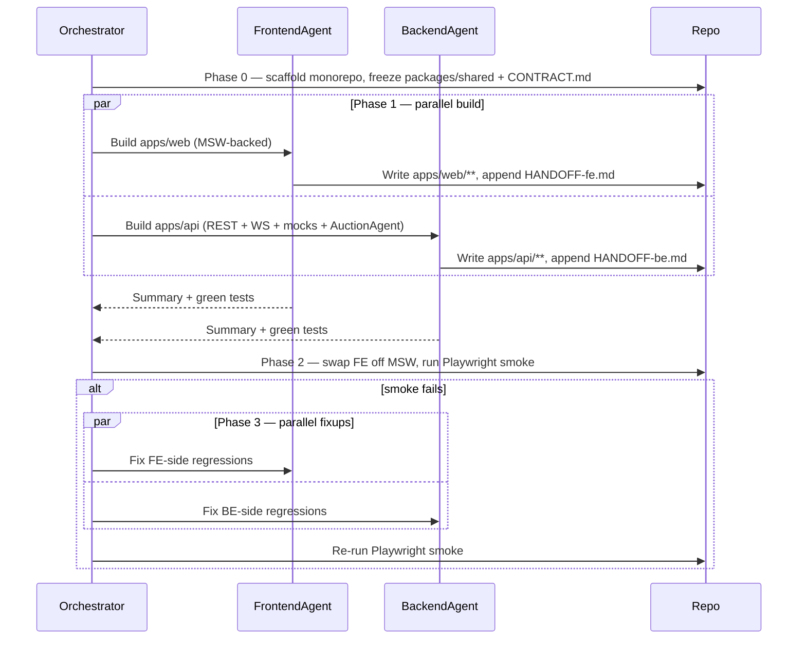

# The Block — Architecture

Architecture design for a buyer-side vehicle auction microsite built against OPENLANE's [README.md](README.md) challenge. Uses the section order from [SUBMISSION.md](SUBMISSION.md), but treats every section as a locked architectural decision rather than a starter outline.

**Stance**: lightning fast, lightweight, real-time, beautiful + minimal, first-time-friendly. One command to run on any computer with Node 20+.

---

## How to Run

Prereqs: **Node 20+**, **npm 10+**. No databases, no Docker, no external accounts.

```bash
git clone https://github.com/rogerfleenor/the-block.git
cd the-block
npm install          # workspace install (apps/web, apps/api, packages/shared)
npm run dev          # boots api on :4000 and web on :5173 via concurrently
```

- Web: <http://localhost:5173>
- API: <http://localhost:4000>
- WS:  <ws://localhost:4000/ws>

Production-mode local run:

```bash
npm run build
npm run start        # serves built web + api in production mode
```

Tests:

```bash
npm test             # all workspaces, Vitest
npm run e2e          # Playwright smoke (browse → detail → Cmd-K agent bid → live update)
```

Optional real integrations (default is fully-mocked, zero-key):

```bash
# Drop a .env in the repo root and toggle any of these:
KBB_LIVE=1            KBB_API_KEY=...
MANHEIM_LIVE=1        MANHEIM_API_KEY=...
NHTSA_LIVE=1          # NHTSA vPIC + Recalls + NCAP are free, no key needed
YOUTUBE_LIVE=1        YOUTUBE_API_KEY=...
AGENT_LLM=openai      OPENAI_API_KEY=...   # or anthropic / ollama / mock (default)
```

---

## Time Spent

Target budget: **~8 hours**, distributed roughly:

| Phase | Hours | Output |
|---|---|---|
| Phase 0 — scaffold, shared contract, CONTRACT.md | 0.75 | Monorepo, Zod schemas, WS events, port/path constants |
| Phase 1a — Backend agent (parallel) | ~2.5 | Fastify + WS + bid engine + ~30 mock providers + AuctionAgent service |
| Phase 1b — Frontend agent (parallel) | ~2.5 | Vite/React SPA, inventory, detail, intel tabs, AuctionAgent UI |
| Phase 2 — integrate, swap off MSW, Playwright smoke | 0.75 | Green end-to-end smoke |
| Polish, README, walkthrough notes | 1.5 | Empty/loading/error states, responsive QA, audit log review |

Wall-clock is shorter than the sum: Phase 1 runs the two engineer agents in **parallel** under one orchestrator (see *Notable Decisions*).

---

## Assumptions and Scope

**Included**
- Buyer-side: inventory browsing, search, filtering, sorting, vehicle detail with gallery, condition + damage notes, dealership, real bid flow with server broadcast.
- Real-time competitive bidding (server is authoritative; multiple browsers update from one source).
- Aggregated **Vehicle Intelligence** from ~30 mock providers (valuation, history, safety, market comps, dealer, registration, liens, fuel, social).
- **AuctionAgent** — AI-powered command bar + smart bid recommendations + inline fact chips + risk banner. Explicitly *not* a chatbot.
- Mobile + desktop responsive (360 / 768 / 1280 breakpoints).

**Excluded (per brief)**
- Authentication, accounts, user profiles.
- Checkout, payments, F&I, financing.
- Seller workflows, dealer admin tooling, inspection upload.

**Simplified**
- All third-party providers are **mocked** but conform to the real response shape so swapping in a live key is a one-line change in `apps/api/src/providers/registry.ts`.
- Bid state lives in memory, snapshotted every 30 s to `apps/api/.data/state.json`. No database — by design for the timebox.
- Auction `auction_start` timestamps are normalized to "now-ish" for live countdowns.
- LLM default is a **deterministic rule-based router** so the app runs on any machine with zero API keys; OpenAI / Anthropic / Ollama swap in via env flag.
- 200-row dataset means filters and search run server-side in memory with no index.

---

## Stack

### Frontend (`apps/web/`)
- **Vite 5** — fastest dev loop, smallest static bundle of any mainstream tool.
- **React 18 + TypeScript strict** — most reviewer-familiar framework; TS for craft.
- **Tailwind CSS** (JIT, purged) — <10 KB CSS in production, fast UI work.
- **React Router v6** (data routers) — de-facto SPA router.
- **Zustand** (`persist` → `localStorage`) — ~1 KB state, no Redux boilerplate.
- **TanStack Query** — stale-while-revalidate, cache, retries, focus refetch.
- **TanStack Virtual** — 60-fps inventory grid.
- **Native WebSocket** + **BroadcastChannel** — server is the source of truth; BC is a same-browser cross-tab fan-out.
- **MSW** (dev only) — service-worker-level API mocks that validate against the same Zod schemas the backend uses.

### Backend (`apps/api/`)
- **Node 20 + Fastify 4** — faster than Express, native Zod schema/type integration, first-class WS plugin.
- **`@fastify/websocket`** — WS broadcast for bid + intel + agent events.
- **`@fastify/cors`, `@fastify/rate-limit`, `@fastify/compress`** — gzip/br, 10 req/min/IP on bid POSTs.
- **`fastify-type-provider-zod`** — request/response validation from shared Zod schemas.
- **Pino** — structured logging with one request-id per call propagated into provider mocks.
- **In-memory store** seeded from `data/vehicles.json` on boot, snapshotted every 30 s.

### AI (AuctionAgent)
- **Vercel AI SDK (`ai`)** — uniform `generateText({ model, tools, system })` + `tool` definitions + streaming, with swappable model adapters.
- **`mockLLM`** (default) — deterministic rule-based intent router; runs on any machine with zero keys, used by CI and Playwright.
- **`openai` / `anthropic` / `ollama`** — drop-in live models behind a single `AGENT_LLM` env flag.

### Database
- **None.** In-memory store + periodic JSON snapshot. The 200-row dataset is tiny; adding SQLite (`better-sqlite3`) is a one-day future step.

### Shared (`packages/shared/`)
- TypeScript types + **Zod** schemas for Vehicle / Bid / Intel / WS events / AuctionAgent (`AgentFact`, `AgentSuggestion`, `AgentAction`, `ToolCall`). One source of truth for the contract — imported by web (MSW + runtime parse), api (request/response validation), and tests.

---

## What I Built

### High-level architecture



### Monorepo layout

```
the-block/
  package.json                # workspaces: apps/*, packages/*
  apps/
    web/                      # Vite + React SPA
      src/
        app/{routes,layout}.tsx
        features/
          inventory/          # grid, filters, sort, virtualization
          vehicle/            # detail, gallery, specs, intel panels
          bidding/            # bid panel, optimistic UI, history
          intel/              # provider cards
          agent/              # AuctionAgent UI surfaces (no chat)
            CommandBar.tsx          # Cmd-K palette
            SmartBidBar.tsx         # AI Max Bid pill
            FactChip.tsx
            RiskBanner.tsx
            CompareStrip.tsx
            ConfirmAction.tsx       # 5-second confirm card
            agentClient.ts
            agentStore.ts
    api/                      # Node + Fastify + WS
      src/
        server.ts
        routes/{vehicles,bids,intel,ws}.ts
        services/{vehicleStore,bidEngine,intelAggregator}.ts
        agent/
          index.ts            # POST /api/agent/invoke
          router.ts           # mockLLM intent router
          llm.ts              # Vercel AI SDK adapter
          tools/              # placeBid, getIntel, recommendMaxBid, ...
          guardrails.ts
          log.ts              # .data/agent-log.jsonl
        providers/            # ~30 *.mock.ts behind one interface
        lib/{cache,seedRng,logger}.ts
        .data/state.json
  packages/
    shared/                   # Vehicle/Bid/Intel/Agent zod + WS events
  data/
    vehicles.json
```

### REST + WebSocket contract

REST (all JSON, Zod-validated, gzip/br on, ETag on GET):

```
GET  /api/health
GET  /api/vehicles?make&body&province&title&minPrice&maxPrice&minGrade&sort&q&cursor&limit
GET  /api/vehicles/:id
GET  /api/vehicles/:id/bids
POST /api/vehicles/:id/bids                 { amount, bidder? }
GET  /api/vehicles/:id/intel                composite from all providers
GET  /api/vehicles/:id/intel/:provider      raw per-provider response
GET  /api/providers                         catalog (name, category, mock|live)
POST /api/agent/invoke                      { utterance, context } → facts/suggestions/actions
GET  /api/agent/facts/:vehicleId            pre-computed fact chips (cached)
```

WebSocket: `GET /ws`

```
Client → Server:  { type: "subscribe", topic: "vehicle:<id>" | "inventory" | "agent:<traceId>" }
Server → Client:  bid:updated, auction:ending, intel:patch,
                  agent:fact, agent:suggestion, agent:trace
```

### Real-time bidding (Cmd-K agent flow)



### Bid rules (prototype-grade)
- Minimum increment: `max($100, 1% of current bid)`.
- If `current_bid` is null, must be ≥ `starting_bid`.
- Reserve shown as "Reserve met / not met" — number hidden.
- `buy_now_price` (when present) renders a secondary "Buy Now" that immediately wins the lot.
- Server is authoritative; client UI is optimistic with rollback.
- Server-side bot bidders run one `setInterval` per active auction (10–45 s) so the live feel exists across users, not just across browser tabs.

### AuctionAgent — AI as a core assist tool (not a chatbot)

People hate chat bubbles in product UI. AuctionAgent is built as an **intent + action** surface. Every AI capability renders as one of:

- a **fact chip** with a "Why?" popover that cites the providers used,
- an **action suggestion** rendered as a 5-second confirm card,
- an **inline answer** in a Cmd-K command bar.

There is no message thread, no avatar, no chat history persisted.

**Surfaces**
- **Command bar (Cmd-K / `/`)** — natural language → typed tool calls. Examples:
  - `bid 24800` → confirm card
  - `is this overpriced?` → 2 fact chips with sources
  - `show low-mileage AWD trucks under 25k in ontario` → applies filters
  - `any recalls or title issues?` → risk facts
- **Smart Bid Bar** — `✦ AI Max Bid $25,800` pill with hover rationale (KBB / MMR / condition / bidder pressure → cap formula).
- **Inline fact chips** — appear inside intel tabs (`Below MMR by $1.2k`, `Reserve likely met`, `Active recall`, `2 comps sold $24.1–24.8k`).
- **Risk banner** — only mounts when warranted (title brand, severe damage cluster, repo history, open recall).
- **Compare strip** — 2–3 comps inline on detail with Δ vs current bid.

**Typed tools** (`apps/api/src/agent/tools/`, each Zod-validated, allowlisted)
- `placeBid`, `searchInventory`, `getIntel`, `recommendMaxBid`, `findComps`, `explainPrice`, `flagRisks`, `setFilters`, `goto`.

**Safety**
- `placeBid` **never** auto-executes. It returns an `AgentSuggestion` that the UI surfaces as a 5-second confirm card defaulting to **Cancel** at 0 s. `Esc` cancels immediately.
- Tool allowlist + Zod input/output validation before any service call.
- Full audit log at `apps/api/.data/agent-log.jsonl`.
- Source attribution on every fact chip.
- `POST /api/agent/invoke` is rate-limited (20 req/min/IP).

### Mock provider catalog

~30 providers grouped by category; each mock returns the shape of the real provider so the swap to live is mechanical. Mocks are **VIN-deterministic** via a seeded PRNG (`mulberry32`) — same VIN, same output every time. Latency simulated at 20–220 ms; 2 % synthetic failure rate so graceful-degradation UX is exercised.

| Category | Providers (mock today, live-ready) |
|---|---|
| **Valuation & pricing** | Kelley Blue Book, Manheim MMR (incl. `averageEVBH` for EVs), ADESA (OPENLANE-owned, on-brand), Black Book, J.D. Power / NADA, Edmunds TMV |
| **History, title, theft** | CARFAX VHR, Experian AutoCheck, NMVTIS, NICB, VINaudit |
| **Specs / VIN decode** | NHTSA vPIC (free, no key), DataOne, Marti Auto Works, Monroney sticker |
| **Safety & recalls** | NHTSA Recalls, NHTSA NCAP, IIHS / HLDI |
| **Auction & market comps** | Copart, IAA, MarketCheck, Cox vAuto |
| **Dealer / DMS / inventory** | CDK Global Fortellis (Merchandisable Vehicles + LVI), Reynolds & Reynolds, Dealertrack |
| **Registration / ownership** | Polk / S&P Global Mobility, DMV |
| **Liens, repo, legal** | KAR RDN (repossession), LexisNexis (liens / UCC / PPSA), traffic-court records |
| **Fuel & emissions** | fueleconomy.gov, EPA Green Vehicle Guide |
| **Social / reviews / sentiment** | YouTube Data API, Reddit, TikTok, Instagram, X / Twitter, Edmunds reviews, Cars.com reviews |
| **Photography** | Spincar (360° spin) |
| **LLM (AuctionAgent)** | `mockLLM` (default), OpenAI `gpt-4o-mini`, Anthropic `claude-3-5-haiku`, Ollama (any local model) |

Composite `/intel` aggregator uses `Promise.allSettled` across providers with per-provider timeouts and a TTL cache.

### Wireframes (low-fidelity, ASCII)

Structure-only. Visual treatment will use a single accent color, neutral grayscale, system font, generous whitespace.

#### Inventory `/` — desktop (≥1280)

```
┌──────────────────────────────────────────────────────────────────────────────┐
│ ◆ the-block               Search make, model, VIN…              ⌘K     ⚙   │
├──────────────────────────────────────────────────────────────────────────────┤
│ FILTERS                │ Sort: [Ending soon ▾]    247 lots    • Live ●     │
│ ───────                │ ┌─────────────┐ ┌─────────────┐ ┌─────────────┐    │
│ Make                   │ │   [photo]   │ │   [photo]   │ │   [photo]   │    │
│ ☐ Toyota   ☐ Ford      │ │             │ │             │ │             │    │
│ ☐ Honda    ☐ Chevy     │ │ 2023 Ford   │ │ 2019 Chevy  │ │ 2017 VW     │    │
│ ☐ BMW      ☐ Tesla     │ │ Bronco BBend│ │ Equinox LS  │ │ Golf GTI SE │    │
│                        │ │ 47,731 km   │ │ 126,793 km  │ │ 145,064 km  │    │
│ Body                   │ │ ●●●●○ 3.8   │ │ ●●○○○ 2.7   │ │ ●●○○○ 2.1   │    │
│ ☐ SUV    ☐ Truck       │ │             │ │             │ │             │    │
│ ☐ Sedan  ☐ Hatch       │ │ $22,800 ▲   │ │ $12,500     │ │ $10,000     │    │
│                        │ │ 16 bids     │ │ 13 bids     │ │  1 bid      │    │
│ Price                  │ │ Ends 2h 14m │ │ Ends 4h 02m │ │ Ends 7h 41m │    │
│ [$0]──●───[$60k]       │ └─────────────┘ └─────────────┘ └─────────────┘    │
│                        │ ┌─────────────┐ ┌─────────────┐ ┌─────────────┐    │
│ Province / Title /     │ │     …       │ │     …       │ │     …       │    │
│ Min condition grade    │ └─────────────┘ └─────────────┘ └─────────────┘    │
│                        │                                                    │
│ [ Reset ]   [ Apply ]  │                                                    │
└──────────────────────────────────────────────────────────────────────────────┘
   Hint: press / to search, ⌘K for AuctionAgent
```

`▲` after a price = the card just received a live bid update via WS in the last 3 s.

#### Inventory `/` — mobile (≤768)

```
┌────────────────────────────┐
│ ◆ the-block          ⌘K ☰  │
├────────────────────────────┤
│  Search…                   │
│ [Ending soon ▾] [Filters●] │
├────────────────────────────┤
│ ┌────────────────────────┐ │
│ │      [photo]           │ │
│ │ 2023 Ford Bronco BBend │ │
│ │ 47,731 km · ●●●●○ 3.8  │ │
│ │ $22,800 ▲  16 bids     │ │
│ │ Ends in 2h 14m         │ │
│ └────────────────────────┘ │
│ ┌────────────────────────┐ │
│ │     …                  │ │
│ └────────────────────────┘ │
└────────────────────────────┘
```

#### Vehicle detail `/v/:id` — desktop

```
┌──────────────────────────────────────────────────────────────────────────────┐
│ ← Back to inventory                                              ⌘K   ⚙     │
├──────────────────────────────────────────────────────────────────────────────┤
│ ⚠ Active NHTSA recall: airbag inflator           [ View details ]    ✕     │
├────────────────────────────────────────────┬─────────────────────────────────┤
│                                            │  Lot A-0043 · Toronto, ON       │
│           ┌──────────────────────┐         │  2023 Ford Bronco · Big Bend    │
│           │       [photo 1]      │         │  VIN TRD7L1KS0HNB5X3K3          │
│           └──────────────────────┘         │  2.7L EcoBoost V6 · 4WD · auto  │
│           ◀ • • ● • • ▶                    │  47,731 km · Burgundy / Beige   │
│           [thumb][thumb][thumb][thumb]     │  ●●●●○ 3.8 · Clean title        │
│                                            │                                 │
│  ┌── Overview · Valuation · History ──┐    │  ┌─── Bid panel ───────────────┐│
│  │       · Safety · Market · Buzz     │    │  │ Current bid     $22,800     ││
│  ├────────────────────────────────────┤    │  │ Min next bid    $23,100     ││
│  │ ✦ Below MMR by $1.2k               │    │  │                             ││
│  │ ✦ Reserve likely met               │    │  │ [ $23,100              ]    ││
│  │ ✦ 2 comps sold $24.1k · $24.8k     │    │  │ ✦ AI Max Bid $25,800  ⓘ    ││
│  │                                    │    │  │                             ││
│  │ KBB trade-in  $21.4k–$23.6k        │    │  │ [    Place Bid          ]   ││
│  │ KBB retail    $25.9k–$28.3k        │    │  │ [    Buy Now $29,500    ]   ││
│  │ MMR wholesale $24.0k (grade 3.8)   │    │  │                             ││
│  │ Black Book    $22.1k                │    │  │ 16 bids · Reserve met       ││
│  │ Sources (6) ▸                      │    │  │ Ends in 2h 14m              ││
│  └────────────────────────────────────┘    │  │                             ││
│                                            │  │ Recent bids                 ││
│  Condition report                          │  │  $22,800  •2m ago           ││
│  Average condition. Has some visible wear  │  │  $22,500  •5m ago           ││
│  on high-touch surfaces. …                 │  │  $22,100  •11m ago          ││
│                                            │  └─────────────────────────────┘│
│  Damage notes                              │                                 │
│  • Scratch on liftgate                     │  Selling dealership             │
│  • Minor rust on wheel wells               │  King City Auto                 │
│  • Paint peeling on roof rack              │  Toronto, ON                    │
└────────────────────────────────────────────┴─────────────────────────────────┘
```

#### Vehicle detail `/v/:id` — mobile (sticky bid bar)

```
┌────────────────────────────┐
│ ←                    ⌘K    │
├────────────────────────────┤
│ ⚠ Active recall      ✕     │
├────────────────────────────┤
│ ┌────────────────────────┐ │
│ │      [photo 1]         │ │
│ │ ◀ • • ● • • ▶          │ │
│ └────────────────────────┘ │
│ 2023 Ford Bronco · BBend   │
│ Lot A-0043 · Toronto, ON   │
│ ●●●●○ 3.8 · Clean          │
│                            │
│ ┌─Overview Val Hist… ▸──┐  │
│ │ ✦ Below MMR by $1.2k  │  │
│ │ ✦ Reserve likely met  │  │
│ │ ✦ 2 comps $24.1–24.8k │  │
│ └────────────────────────┘ │
│                            │
│ Specs · Condition · Damage │
│ …                          │
├────────────────────────────┤  ◀── sticky bid bar
│ $22,800 · 16 bids · 2h 14m │
│ [ $23,100         ] Place ►│
│ ✦ AI Max $25,800  ⓘ        │
└────────────────────────────┘
```

#### AuctionAgent — Cmd-K command bar (overlay)

```
┌──────────────────────────────────────────────────────┐
│ ⌘K   bid 24800_                                  Esc │
├──────────────────────────────────────────────────────┤
│ ↪ Suggested action                                   │
│ ┌──────────────────────────────────────────────────┐ │
│ │ Place bid $24,800 on lot A-0043                  │ │
│ │ 2023 Ford Bronco Big Bend · Toronto, ON          │ │
│ │ Current $22,800 · Min next $23,100 · Reserve met │ │
│ │                                                  │ │
│ │  [ Cancel ]            [ Confirm 5s ▓▓▓░░ ]      │ │
│ └──────────────────────────────────────────────────┘ │
│                                                      │
│ ↪ Related facts                                      │
│ • Below MMR by $1.2k          (KBB, Manheim)         │
│ • 2 comps sold $24.1k, $24.8k (Marketcheck)          │
│                                                      │
│ Try: "is this overpriced?"  "find similar under 25k" │
└──────────────────────────────────────────────────────┘
```

#### AuctionAgent — Smart Bid Bar pill with rationale

```
┌──────────────────────────────────┐
│  ╭──────────────────────────╮    │
│  │ ✦ AI Max Bid $25,800  ⓘ  │  ◀── click prefills the bid input
│  ╰──────────────────────────╯    │
└──────────────────────────────────┘

Hover ⓘ:
┌────────────────────────────────────┐
│ Why $25,800?                       │
│ • KBB retail mid   $27,100         │
│ • MMR wholesale    $24,000         │
│ • Condition grade  3.8 / 5         │
│ • Bidder pressure  high (16 bids)  │
│ Cap = 0.95 × KBB retail mid        │
└────────────────────────────────────┘
```

#### AuctionAgent — Confirm card (toast)

```
┌─────────────────────────────────┐
│ ✦ AuctionAgent suggestion       │
│ Place bid $24,800 on A-0043     │
│ 2023 Ford Bronco Big Bend       │
│                                 │
│ Confirm in 4s ▓▓▓▓░             │
│ [ Cancel ]      [ Confirm ]     │
└─────────────────────────────────┘
```

Auto-defaults to **Cancel** at 0 s. `Esc` cancels. `Enter` confirms.

### Performance budget (targets)

| Surface | Target |
|---|---|
| JS (gz) initial route | < 70 KB |
| JS (gz) total | < 130 KB |
| CSS (gz) | < 12 KB |
| LCP on mid-tier mobile | < 1.5 s |
| Inventory scroll | 60 fps (TanStack Virtual + `content-visibility: auto`) |
| API cold start | < 300 ms |
| `GET /api/vehicles?limit=24` p95 | < 30 ms |
| `GET /api/vehicles/:id/intel` cold (parallel ~25 mocks) | < 350 ms |
| `GET /api/vehicles/:id/intel` warm (cache hit) | < 5 ms |
| `POST /api/agent/invoke` (mockLLM) p95 | < 30 ms |
| Live LLM first token | < 600 ms streaming |

### UX principles
- One accent color, neutral grayscale, system font stack, generous whitespace.
- Big primary actions, no nav clutter.
- Skeletons on load, empty states with helpful copy, optimistic bid with rollback toast.
- Sticky bid bar on mobile detail.
- Keyboard: `/` focuses search, `⌘K` opens AuctionAgent, `Esc` closes sheets / cancels confirms, `Enter` submits.
- Intel cards and AuctionAgent never block the bid flow — they hydrate in.

### Security & ops (prototype-grade)
- CORS locked to `localhost:5173` in dev.
- `@fastify/rate-limit` on `POST /api/vehicles/:id/bids` (10/min/IP) and `POST /api/agent/invoke` (20/min/IP).
- All bodies Zod-validated; unknown fields rejected.
- Pino structured logs; one request-id per call propagated into provider mocks and into `agent-log.jsonl`.
- No secrets in repo; `.env.example` enumerates the real-API flags.

---

## Notable Decisions

- **Why a backend now** — real-time bidding and intel aggregation need a single source of truth and a place to fan out to mock providers. Still one `npm run dev` to start everything.
- **Why mocks behind a provider interface** — lets the demo show breadth of intelligence (KBB, Manheim, CARFAX, CDK, NHTSA, YouTube, etc.) without paid keys, while keeping the swap to live a one-line change in `registry.ts`.
- **Why Fastify over Express** — faster, native Zod schema integration, first-class WebSocket plugin, still common enough to be reviewer-friendly.
- **Why no DB** — 200 records + ephemeral bid state. JSON snapshot is enough for a prototype. Adding SQLite (`better-sqlite3`) is a one-day future step.
- **Why TanStack Query** — cache, stale-while-revalidate, retries, focus refetch — frees us from hand-rolled fetch code.
- **Why client-side virtualization even for ~200 rows** — future-proof, smoother scroll, demonstrates judgment.
- **Why a 2-agent parallel build with a contract-frozen monorepo** — cuts wall-clock roughly in half while eliminating merge conflicts via disjoint write surfaces (`apps/web/**` vs `apps/api/**`) and a Zod-typed shared contract. The Frontend agent uses MSW (validating against the same schemas) so it never blocks on the Backend agent.
- **Why AuctionAgent is *not* a chatbot** — chat UIs add cognitive load and ambiguity to a bidding task that is fundamentally about *facts* and *actions*. Rendering AI output as fact chips, action confirms, and a Cmd-K palette keeps the buyer focused, makes outputs auditable (every chip cites sources), and avoids the failure mode of "wait, what did it actually do?" — bids always require an explicit, time-boxed confirm.
- **Why typed tools + `mockLLM` default** — lets the app run anywhere with zero keys (CI, walkthrough on a fresh laptop), keeps the LLM swap to a single env flag, and makes the agent surface deterministically testable.
- **Why VIN-seeded PRNG mocks** — same VIN always returns the same fake report → stable demos, stable Playwright snapshots, no flaky tests.

### Parallel agent execution plan



| Role | Owns | Communicates via |
|---|---|---|
| Orchestrator | scaffold, `packages/shared`, `CONTRACT.md`, root deps, Playwright e2e, integration | reads HANDOFF files; amends contract if needed |
| Frontend Engineer agent | `apps/web/**` (incl. `features/agent/`) | appends to `.agents/HANDOFF-fe.md`; escalates contract changes |
| Backend Engineer agent | `apps/api/**` (incl. `agent/`) | appends to `.agents/HANDOFF-be.md`; escalates contract changes |

Conflict-free by construction:
1. **Contract-first**: `packages/shared` is read-only for both agents.
2. **Disjoint write surfaces**: no shared files mutated in parallel ⇒ no merge conflicts.
3. **MSW on the frontend** validates against the same Zod schemas the backend serializes with.
4. **VIN-seeded PRNG on both sides** ⇒ identical fake intel for the same VIN.
5. Orchestrator owns root `npm install`; agents only edit their workspace `package.json`.

---

## Testing

- **Vitest (web)** — `bidStore` (validation, optimistic rollback), `format` (currency, relative time), `query` hooks (mocked fetch), `agentStore` (fact/suggestion cache, dismissals).
- **Vitest (api)** — `bidEngine` (rules, increment, reserve), `intelAggregator` (parallel + partial failure), each provider mock returns deterministic output for a fixed VIN, `agent/router` intent parsing across ~20 fixtures, each tool's Zod input/output, `guardrails` rejecting disallowed tool calls.
- **Curl smoke** — `apps/api/scripts/smoke.sh` covers one bid POST and one agent invoke.
- **Playwright** — single end-to-end: load `/` → search "Bronco" → open detail → see intel tabs hydrate → press `⌘K` → type `bid 24800` → confirm → assert WS-driven `bid:updated` updates current bid and bid count.
- **Manual responsive QA** — 360 / 768 / 1280.

---

## What I'd Do With More Time

- Wire one **real** provider end-to-end (NHTSA vPIC is free and easiest).
- Add **SQLite** via `better-sqlite3` for durable bid history + audit log.
- **Watchlist + saved searches** with WS-pushed notifications when watched lots get a new bid.
- **Image CDN** (Cloudflare Images or imgix) with blurhash placeholders and `srcset` density variants.
- **Accessibility audit** (axe) — focus traps in command bar, ARIA on bid bar, contrast.
- **i18n** — EN / FR for the Canadian dataset.
- **Per-vehicle countdowns** pushed from server with drift correction.
- **Dealer profile pages** with their inventory + recent sales.
- **Sentiment analysis** on the social-media intel cards.
- **Voice input** for the command bar (Web Speech API).
- **Prompt-eval harness** over `agent-log.jsonl` to track regression of LLM intent parsing across model swaps.
- Migrate to a **real WebSocket-on-Workers** deploy (Cloudflare Durable Objects) for production-grade real-time.
